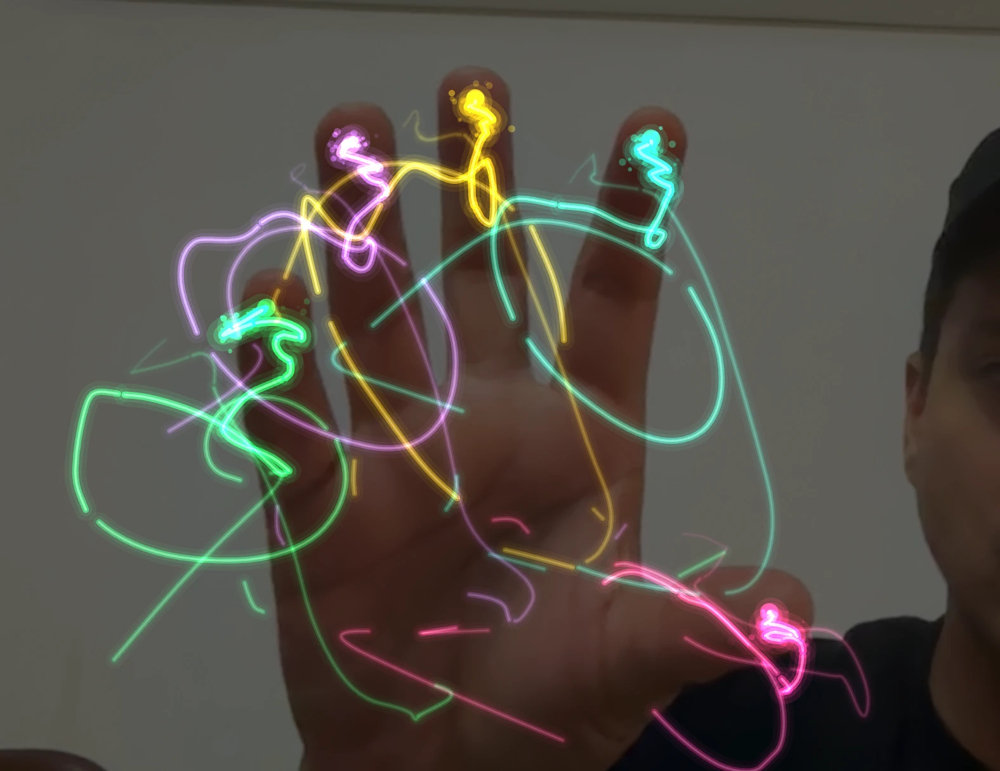

# ✨ AR Magic Draw

> for my daughter

Draw in the air with your hands. The camera tracks the 21 landmarks of each
hand with MediaPipe, and every fingertip leaves a neon trail that fades away on
its own.



Plain static files: no build step, no dependencies to install, no backend.
The detection runtime and model are bundled in the repo, so it doesn't depend
on any CDN and the video never leaves your browser.

```
index.html                      markup
css/styles.css                  styles
js/app.js                       application logic
vendor/mediapipe/               @mediapipe/tasks-vision 0.10.14 (JS + WASM)
models/hand_landmarker.task     hand landmark model (float16)
```

---

## Running it

The camera requires a secure context, so **opening the file by double-clicking
it (`file://`) won't work**. Serve the folder over HTTP:

```bash
python3 -m http.server 8000
```

Then open <http://localhost:8000>.

Any alternative works too (`npx serve`, `php -S localhost:8000`, the VS Code
Live Server extension…), as does any static host with HTTPS.

**Requirements:** a modern browser with WebGL and `getUserMedia` (an
up-to-date Chrome, Edge, Safari or Firefox) and a camera. No internet
connection is needed: the runtime (~9 MB of WASM) and the model (~8 MB) are
served by the same server as the app.

---

## How to draw

Hold your open hand in front of the camera. There are three modes in the top
bar:

| Mode | What it does |
| --- | --- |
| **5 Fingers** | Every **extended** finger paints in its own color. Bend a finger and its stroke lifts. |
| **Index** | Only the index finger paints. Cleaner for writing. |
| **Pinch** | Paints only while you pinch thumb and index together, from the midpoint between them. |

**Make a fist** for a moment to clear the canvas.

It tracks up to **two hands** at once, each with its own five independent
strokes.

### Keyboard shortcuts

| Key | Action |
| --- | --- |
| `C` | Clear the canvas |
| `M` | Mirror effect |
| `B` | Blur the background |
| `F` | Fullscreen |
| `H` | Hide or show the interface |
| `S` | Save a PNG snapshot |
| `R` | Start or stop recording |
| `Space` | Freeze (turns fading off) |
| `1` `2` `3` | Switch mode |

The interface hides itself after 4 seconds of inactivity — handy if you're
projecting it.

---

## Settings

In the gear panel:

- **Fade** — how long each stroke lives, from 0.5 to 20 s.
- **Thickness** and **Glow** of the brush.
- **Smoothing** — from *raw* (responsive, slightly jittery) to *high* (very
  smooth, with a touch of lag).
- **Video opacity** — set it to 0 to draw on pure black.
- **Mirror**, **Sparks** at the fingertip, **Taper** (the stroke thins toward
  its tail) and **Blur BG** (blurs the camera background so the strokes stand
  out).
- **Quality** — High / Medium / Low. Lower it if you're short on FPS: it
  reduces the internal resolution and the number of glow layers.
- **Camera** — a selector, in case you have more than one.
- **Palette** — Neon, Fire, Ice, Rainbow, or a custom color per finger.

Everything is saved to `localStorage`, so next time it starts the way you left
it.

### Freeze

With **❄ Freeze** strokes stop fading and the canvas behaves like a
whiteboard: useful for writing a whole word or drawing something carefully.

### Photo and video

- **📷** saves a PNG.
- **⏺** records a WebM and downloads it when you stop.

Both export exactly what you see — background video and strokes already
composited, with the mirror applied the right way — because everything is
painted onto a single canvas.

---

## How it works

- **Detection:** [`@mediapipe/tasks-vision`][tv] (`HandLandmarker`), version
  0.10.14, vendored in `vendor/mediapipe/`. It tries the GPU and falls back to
  the CPU if it can't.
- **One canvas.** The video and the strokes are painted onto the same
  `<canvas>`, which makes taking a photo or recording trivial.
- **Coordinates.** Points are stored normalized to the camera frame and
  projected every frame, so resizing the window doesn't distort what's already
  drawn. The mapping replicates the video's `cover` crop, so the stroke always
  lands right under the fingertip.
- **Smoothing.** MediaPipe landmarks jitter a few pixels per frame. A
  [One Euro][oe] filter per fingertip removes that noise while the hand is
  still without adding lag when it moves fast.
- **Glow.** Instead of `shadowBlur` — very expensive on long strokes — the glow
  is built from several passes of varying width and opacity in `lighter` mode.
  As a bonus, crossing strokes add light instead of getting muddy.
- **Fading.** Each stroke is split into bands by age, and each band is drawn
  with its own opacity and width. The tail truly dissolves, with a handful of
  draw calls instead of one per segment.
- **Background blur.** The video frame is shrunk onto a small offscreen canvas,
  blurred there and stretched back up, which is far cheaper than blurring at
  full resolution. Browsers without `ctx.filter` get a soft look from the
  downscale alone.
- **Gestures.** A finger counts as extended if its tip is farther from the
  wrist than its middle knuckle; measuring it this way works with the hand
  rotated, which comparing heights doesn't. The two hands are told apart by
  MediaPipe's handedness label, not by their position in the array, which
  changes from frame to frame.

[tv]: https://ai.google.dev/edge/mediapipe/solutions/vision/hand_landmarker/web_js
[oe]: https://gery.casiez.net/1euro/

---

## Notes and limitations

- The gesture thresholds (when a finger counts as extended, when a pinch counts
  as closed) are reasonable defaults, but you may want to tune them: they live
  in `isExtended()` and `isPinching()` in `js/app.js`.
- It needs decent lighting. Backlit or in dim light, detection becomes
  intermittent.
- Recording produces WebM, which Safari doesn't always play natively.
- Runtime and model are self-hosted, so it works offline or on a kiosk
  without network access. To upgrade MediaPipe, replace `vendor/mediapipe/`
  with the `vision_bundle.mjs` and `wasm/` folder from the new
  `@mediapipe/tasks-vision` npm package, and the model with a newer
  `hand_landmarker.task` from Google's MediaPipe model storage.
